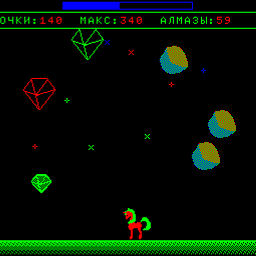

# Игра для БК-0010-01 на базе ассемблера PDP-11.

[](https://yoomoney.ru/to/41001497003495)
[](https://boosty.to/ponygames)
[](https://tav-developer.itch.io)
[](#)
[](#)
[](#)

### О проекте

Игра представляет собой простую экшн-игру, целью игрока - собрать как можно больше падающих алзмазов. Разные алмазы имеют разную стоимость. Игра заканчивается с падением последнего алмаза.

Игра рассчитана на работу на БК-0010 без дополнительных контроллеров, и использует ЕМТ монитора БК-0010.

 

### Состав репозитория

* docs - авторские заметки о разработке
* examples - учебные примеры разработки для БК-0010 (видео, клавиатура, таймер, звук, генератор и т.д.).
* sprites - спрайты в формате png
* src - исходные коды самой игры
* setup - скрипты создания дистрибутивов игры
* tools - исходные коды дополнительных авторских утилит (конвертер спрайтов, конвертер интро и конвертер текста)

### Инструменты сборки

Для сборки бинарного файла используется
компилятор [БК Турбо8](https://gid.pdp-11.ru/bkturbo8_doc.html)

WAV-файлы для отправки на БК-0010 через звуковое устройство сформированы утилитой
[bkbin2wav](https://github.com/raydac/bkbin2wav)

При подготовке zip-архива c игрой для запуска под Windows в него встраивается
[эмулятор БК](https://gid.pdp-11.ru/)

Создание zip-архивов выполняется с помощью скриптовой утилиты построения архивов
[SmartZipBuilder](https://github.com/tereshenkovav/SmartZipBuilder)

Дополнительные инструменты из каталога tools могут быть собраны любой версией .NET, начиная с NET Core командой 

```
dotnet build -c Release
```

### Структура проекта

* ponydiamonds.asm - главный файл игры, содержит основной код
* sprites.inc - включаемый файл несжатых спрайтов в формате 2 бита на пиксель
* intro.inc - включаемый файл данных заставки
* strings-ru.utf8 - строковые константы игры в кодировке UTF8 русская версия
* strings-en.utf8 - строковые константы игры в кодировке UTF8 английская версия
* build_by_turbo8.bat - скрипт сборки для Турбо8, просто копирует strings-ru.utf8 в strings.inc и вызывает BKTurbo8, указывая, что входной файл в кодировке UTF8
* proc_drawsprite.inc - процедуры работы со спрайтами
* proc_genrnd.inc - процедуры генерации псевдослучайных значений
* proc_helpers.inc - процедуры очистки экрана и работы со звуком
* proc_int2str.inc - процедуры получения строкового представления числа
* proc_keytester.inc - процедуры работы с клавиатурой
* sub_hitbox.inc - процедуры вычисления соударений объектов
* sub_intro.inc - процедуры вывода заставки
* sub_prints.inc - процедуры вывода текстовых блоков
* sub_sounds.inc - процедуры звуковых эффектов
* sub_stars.inc - процедуры вывода звезд фона
* vars.inc - включаемый файл переменных

Для сборки проекта, в каталоге `src` должен располагаться файл `version.inc`
с текстовым содержимым вида

```
MSGVER: .ASCIZ  "v0.0.0"
```
При создании дистрибутивов, данный файл формируется автоматически из тэга git,
для ручной сборки через пакетный файл его нужно создать самому.
