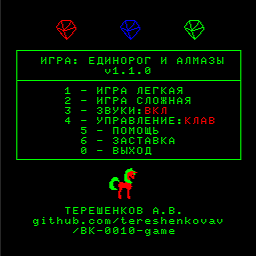

Игра для БК-0010-01 на базе ассемблера PDP-11.\
BK-0010-01 video game on PDP-11 assembler.

**О проекте**

Игра представляет собой простую экшн-игру, целью игрока - собрать как можно больше падающих алзмазов. Разные алмазы имеют разную стоимость. Игра заканчивается с падением последнего алмаза.

 

**Состав репозитория**

* docs - авторские заметки о разработке
* examples - учебные примеры разработки для БК-0010 (видео, клавиатура, таймер, звук, генератор и т.д.).
* sprites - спрайты в формате png
* src - исходные коды самой игры
* tools - исходные коды дополнительных авторских утилит (конвертер спрайтов и конвертер текста)

**Инструменты сборки**

Для сборки бинарного файла используется компилятор pdp11asm

https://github.com/purplesyringa/pdp11asm

WAV-файлы для отправки на БК-0010 через звуковое устройство сформированы утилитой bkbin2wav

https://github.com/raydac/bkbin2wav

Дополнительные инструменты из каталога tools могут быть собраны любой версией .NET, начиная с NET Core командой 

```
dotnet build -c Release
```

**Структура проекта**

* ponydiamonds.asm - главный файл игры, содержит основной код
* sprites.inc - включаемый файл несжатых спрайтов в формате 2 бита на пиксель
* strings-ru.win - строковые константы игры в кодировке WIN1251
* build.bat - скрипт сборки, создает из strings-ru.win в кодировке WIN1251 файл strings-ru.inc в кодировке для БК-0010 и вызывает pdp11asm
* ascii_table - таблица преобразований между кодировками WIN1251 и БК-0010 (только верхний регистр), нужна только для конвертации файла strings-ru.win
* proc_drawsprite.inc - процедуры работы со спрайтами
* proc_genrnd.inc - процедуры генерации псевдослучайных значений
* proc_int2str.inc - процедуры получения строкового представления числа
* proc_keytester.inc - процедуры работы с клавиатурой
* sub_hitbox.inc - процедуры вычисления соударений объектов
* sub_prints.inc - процедуры вывода текстовых блоков

**Заметки по самостоятельной сборке проекта**

Для возможности получения файла strings-ru.inc без инструмента конвертации кодировок, он был включен в релиз 0.5.0 вместе с бинарным и wav файлом. Его нужно скопировать в каталог src и отключить в build.bat строку вызова конвертера, либо собрать проект одной командой

```
pdp11asm ponydiamonds.asm
```
